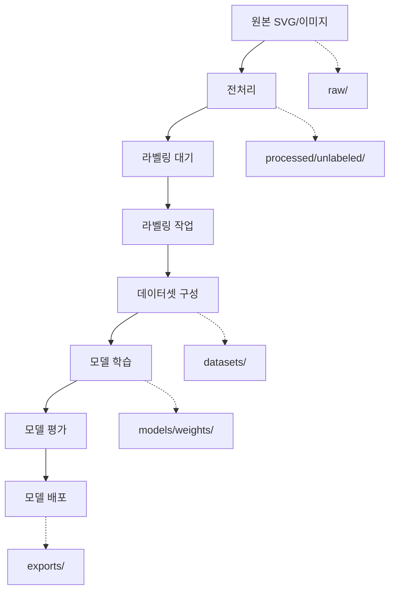

# 🗂️ 데이터 관리 시스템 가이드

AWS 아이콘 탐지 프로젝트의 체계적인 데이터 관리를 위한 통합 시스템입니다.

## 📋 목차

- [시스템 개요](#시스템-개요)
- [디렉터리 구조](#디렉터리-구조)
- [버킷 Prefix 전략](#버킷-prefix-전략)
- [사용법](#사용법)
- [데이터 워크플로우](#데이터-워크플로우)
- [마이그레이션 가이드](#마이그레이션-가이드)

## 시스템 개요

이 시스템은 AI 모델 학습을 위한 데이터의 전체 라이프사이클을 관리합니다:

1. **원본 데이터 수집** - SVG 파일, 이미지 등 원본 소스
2. **전처리** - 이미지 변환, 크기 조정, 품질 향상
3. **라벨링** - 객체 탐지를 위한 주석 작업
4. **데이터셋 구성** - 학습/검증/테스트 데이터 분할
5. **모델 학습** - YOLO 모델 학습 및 검증
6. **모델 배포** - 최적화된 모델 내보내기

## 디렉터리 구조

### 📁 로컬 디렉터리

```
data/
├── raw/                    # 원본 데이터 (SVG, 이미지)
├── processed/              # 전처리된 데이터 (라벨링 대기)
├── datasets/               # 완성된 데이터셋들
├── models/                 # 학습된 모델 저장
└── temp/                   # 임시 작업 파일
```

### ☁️ MinIO 버킷 구조

```
aws-diagram-object-detection/
├── raw/                        # 원본 데이터
│   ├── svg_files/              # SVG 원본들
│   └── images/                 # 기타 이미지 원본들
├── processed/                  # 전처리된 데이터
│   ├── unlabeled/              # 라벨링 대기 중
│   └── temp/                   # 임시 처리 파일들
├── datasets/                   # 완성된 데이터셋들
│   ├── aws_icon_detector_v4/   # AWS Icon Detector v4
│   │   ├── train/
│   │   │   ├── images/
│   │   │   └── labels/
│   │   ├── test/
│   │   │   ├── images/
│   │   │   └── labels/
│   │   └── data.yaml
│   └── custom_dataset_v1/      # 커스텀 데이터셋
├── models/                     # 학습된 모델들
│   ├── weights/                # 모델 가중치
│   ├── configs/                # 모델 설정
│   └── experiments/            # 실험 결과
└── exports/                    # 배포용 모델
    ├── onnx/
    ├── tensorrt/
    └── mobile/
```

## 버킷 Prefix 전략

### 🎯 설계 원칙

1. **라이프사이클 기반**: 데이터의 처리 단계별 분류
2. **확장성**: 새로운 데이터셋과 모델 추가 용이
3. **버전 관리**: 데이터셋과 모델의 버전 추적
4. **일관성**: 명확하고 예측 가능한 네이밍 규칙

### 🗂️ Prefix 규칙

| 카테고리 | Prefix | 설명 | 예시 |
|---------|--------|------|------|
| 원본 데이터 | `raw/` | 수집된 원본 파일들 | `raw/svg_files/aws-ec2.svg` |
| 전처리 데이터 | `processed/` | 변환/처리된 파일들 | `processed/unlabeled/ec2_416x416.png` |
| 데이터셋 | `datasets/` | 완성된 학습 데이터셋 | `datasets/aws_icon_detector_v4/` |
| 모델 | `models/` | 학습된 모델과 결과 | `models/weights/best_v4.pt` |
| 배포 | `exports/` | 배포용 최적화 모델 | `exports/onnx/model_v4.onnx` |

### 📝 네이밍 컨벤션

- **데이터셋**: `{이름}_{버전}` (예: `aws_icon_detector_v4`)
- **모델**: `{이름}_{날짜}_{성능}` (예: `yolov8_20250106_map85`)
- **타임스탬프**: `YYYYMMDD_HHMMSS` 형식 사용

## 사용법

### 🔧 초기 설정

```python
from modules.data_manager import DataManager

# 데이터 매니저 초기화
dm = DataManager('aws-diagram-object-detection')
```

### 📤 데이터 업로드

```python
# 1. 원본 데이터 업로드
dm.upload_raw_data('./my_svg_file.svg', 'svg_files')
dm.upload_raw_data('./my_image.png', 'images')

# 2. 전처리된 데이터 업로드 (라벨링 대기)
dm.upload_processed_data('./processed_image.png', 'unlabeled')

# 3. 완성된 데이터셋 업로드
dm.upload_dataset('./my_dataset/', 'custom_icons', 'v1')
```

### 📥 데이터 다운로드

```python
# 데이터셋 목록 조회
datasets = dm.list_datasets()

# 특정 데이터셋 다운로드 및 로컬 설정
config_path = dm.generate_local_config('datasets/aws_icon_detector_v4/')
```

### 🔄 기존 데이터 마이그레이션

```python
# 기존 데이터를 새로운 구조로 자동 이전
dm.migrate_existing_data()
```

## 데이터 워크플로우

### 🔄 전체 파이프라인



### 📊 단계별 설명

1. **수집 단계** (`raw/`)
   - SVG 파일, 이미지 원본 저장
   - 메타데이터와 함께 타임스탬프 기록

2. **전처리 단계** (`processed/`)
   - 이미지 형식 변환 (SVG → PNG)
   - 크기 표준화 (416x416)
   - 품질 향상 (업스케일링)

3. **라벨링 단계** (`processed/unlabeled/` → `datasets/`)
   - 객체 탐지 주석 작업
   - 라벨 형식 변환 (.npy → .txt)

4. **학습 단계** (`datasets/` → `models/`)
   - YOLO 모델 학습
   - 실험 결과 및 가중치 저장

5. **배포 단계** (`models/` → `exports/`)
   - 모델 최적화 (ONNX, TensorRT)
   - 배포용 패키징

## 마이그레이션 가이드

### 🚀 빠른 시작

1. **노트북 실행**:
   ```bash
   jupyter notebook data_migration.ipynb
   ```

2. **자동 마이그레이션**:
   - 기존 `AWS-Icon-Detector--4/` 데이터셋 이전
   - `data/processed/` 파일들을 라벨링 대기 상태로 이전

3. **결과 확인**:
   - MinIO 버킷에서 새로운 구조 확인
   - 로컬 데이터 디렉터리 생성 확인

### 📋 마이그레이션 체크리스트

- [ ] MinIO 연결 확인
- [ ] 기존 데이터 백업
- [ ] 자동 마이그레이션 실행
- [ ] 데이터 무결성 검증
- [ ] 새로운 워크플로우 테스트

### ⚡ 성능 최적화 팁

1. **배치 업로드**: 여러 파일을 한 번에 처리
2. **압축 전송**: 대용량 파일은 압축 후 업로드
3. **병렬 처리**: 독립적인 작업은 병렬 실행
4. **캐싱**: 자주 사용하는 데이터는 로컬 캐시

## 🔧 고급 설정

### 환경 변수

```bash
# MinIO 설정
MINIO_ENDPOINT=http://100.97.183.123:9000
MINIO_ACCESS_KEY=minio
MINIO_SECRET_KEY=miniosecret

# 로컬 데이터 경로
DATA_ROOT=./data
```

### 커스텀 설정

```python
# 커스텀 prefix 설정
dm = DataManager(
    bucket_name='my-bucket',
    local_root='./my_data'
)

# 커스텀 prefix 오버라이드
dm.prefixes['experiments'] = 'exp/'
```

## 📞 지원 및 문의

- **문서**: 이 파일의 내용 참고
- **이슈**: GitHub Issues에 버그 리포트
- **개선사항**: Pull Request로 기여

---

*이 문서는 AWS 아이콘 탐지 프로젝트의 데이터 관리 시스템 v1.0을 기준으로 작성되었습니다.*